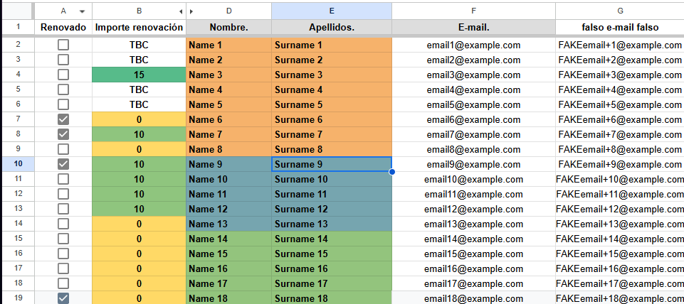

# “Renewals 2026” Script (Google Apps Script)

## What it does

This script iterates over a Google Sheets file and **sends a personalized HTML email** to each member **who has NOT renewed yet** and **has a calculated membership fee** (not “TBC”).
It also **prints a summary to the logs** (how many rows were checked, how many already renewed, how many with TBC, etc.).

## Requirements

* A **Google Sheet** you have access to, with a sheet named **`Importes`** (the names can be changed, but make sure they match).
* The first row must contain the following columns (with the exact names used in the script or change them but make sure they match):

  * `Renovado`
  * `Importe renovación`
  * `Nombre.`
  * `Apellidos.`
  * `E-mail.`

## Quick setup (things you can change)

Inside `sendPersonalizedEmailsRenovaciones()` you must adjust:

* **Spreadsheet**: the Sheet URL passed to `getFileIdFromUrl("...")`
* **sheetName**: `"Importes"`
* **Email subject**: `draftSubject`
* **Signature**: `boardName`, `boardPronouns`, `boardSpot`
* **Column names**: `columnaRenovacion`, `columnaImporte`, etc. for easier configuration and remove chance for error

## Sending logic (important)

For each row:

1. If `Renovado` is `TRUE` → **no email is sent** (already renewed).
2. If `Importe renovación` is `"TBC"` (usually for previous board members who dont know if they have to pay until they show their report in the assembly) → **no email is sent** (fee not yet calculated).
3. If `Importe renovación` is `0` → sends the **no-payment version** (form only).
4. Otherwise → sends an email including:

   * fee amount from `Importe renovación`
   * payment concept: `RENEWAL FirstName LastName`
   * IBAN + instructions + link to the form

## How to run it

1. Open **Google Apps Script** (Extensions → Apps Script) in your project.
2. Paste the code and save it.
3. Run the function:

   * `sendPersonalizedEmailsRenovaciones`
4. The first time, Google will ask for permissions:

   * access to Google Sheets
   * permission to send emails (MailApp)

## Viewing results / debugging

* Go to **Executions** in the left panel to see:

  * which rows were skipped and why
  * which emails were sent
  * the final execution summary

## Recommendations before “production”

* Do a **test run** with 2–3 rows and your own email address.

  * You can temporarily set
    `columnaEmail = "falso e-mail falso"` (already commented in the script) if a test column exists.
* Make sure the `E-mail.` column has no empty cells (MailApp will fail otherwise).
* Keep Gmail / Apps Script daily sending limits in mind if the list is large. (Sending limit is 100 per day for @gmail.com accouts)

## Helper functions

* `getFileIdFromUrl(url)`: extracts the **fileId** from a Google Sheets URL.
* `createSignature(nombre, cargo)`: generates an HTML signature (not used in this script, as the active signature is defined in `firmaHTML`).
